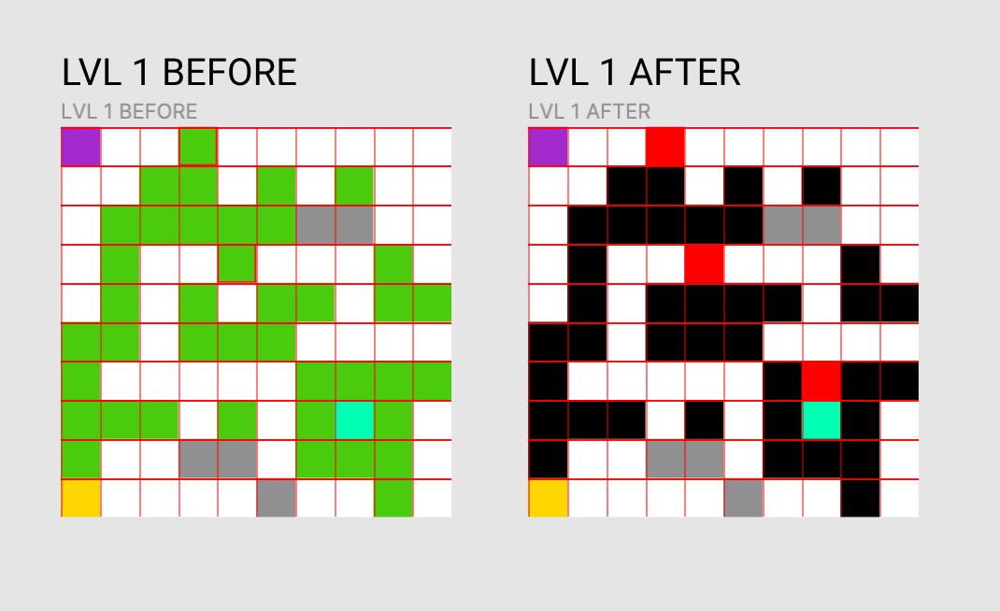

# KANGOU FIRE

[Go to website](https://kangoufire.netlify.com/)

This is a vanilla javascript **2D maze game** based around the fact that the player can swap between environments.
You're playing a kangourou in Australia forest, and you'll have find you way to the burrow. To get to the burrow you can push rocks or you can press **SPACE BAR** to swap on the second environment, but be careful to not swap on fire.

## Go hard or go home

This game is **not easy** and you'll certainly not win the game without dying. This is why we added an auto-save feature using session.storage(). Just make sure to not close the windows or you'll lose all your progression.

## Sounds
You can disabled sound by pressing **S**.

## Game Design

The game uses two dimensional javascript array to store all the levels information which was designed in Figma, making the implementation of new levels to the game easier.

**The game currently have 5 levels**

## Group members of Kangou Fire

- [Wendy Paulos](https://github.com/WPaulos)
- [Reda Hamouche](https://github.com/RedaHamouche)
- [Quentin Grancher](https://kangoufire.netlify.com/)
- [Attar Ramtim](https://github.com/ramtinattar)
